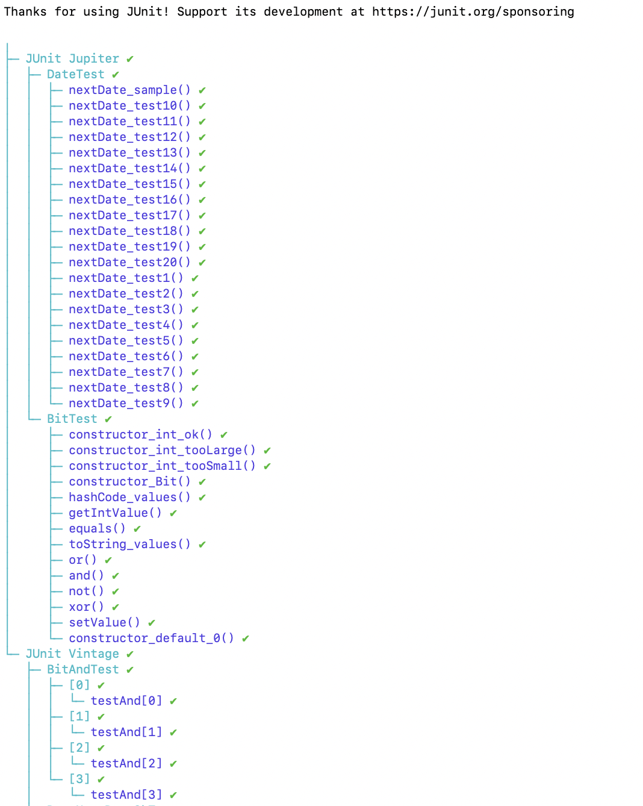
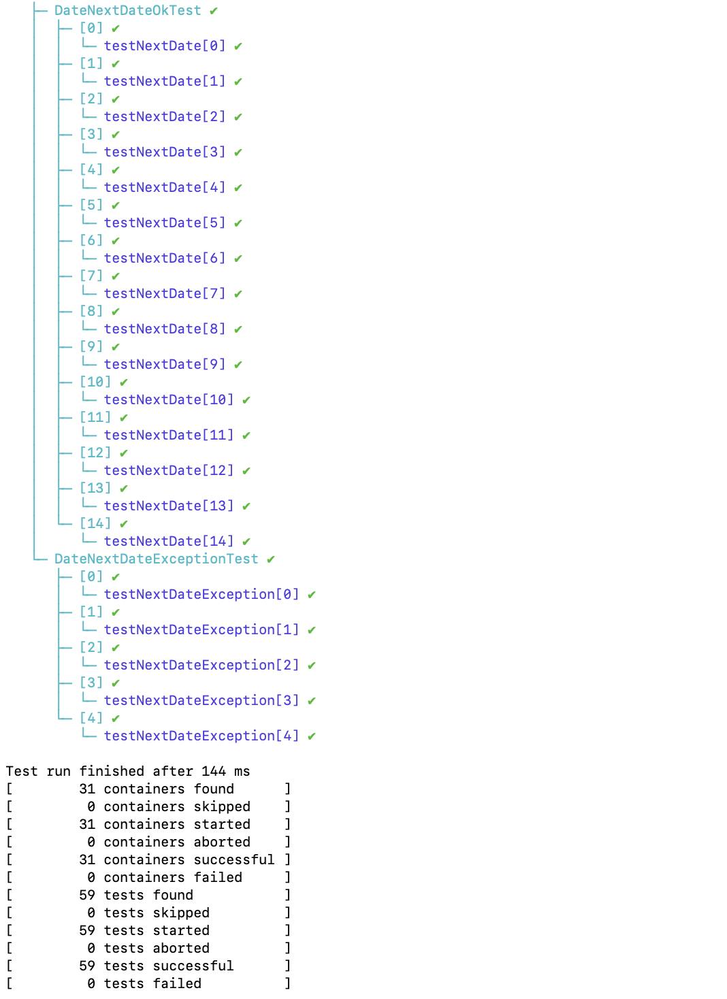

# SEG3103 Laboratory 2

| Information | Value |
| --- | --- |
| Course | SEG 3103 |
| Semester | Summer 2021 |
| Professor | Andrew Forward |
| TA | Henry Chen |
| Student 1 | Félix Larouche (30014453) |
| Student 2 | Emma Dobson Takoff (300108505) |

This is the second laboratory for the course SEG3103.


## Exercise 1

**Run the sample test cases created from the tutorial, and report the results in the table below.**

**For each test case, specify the Expected Results (from the test case), the Actual Results (from the execution) and a Verdict (Pass if Actual Result and Expected Results match, Fail if Actual Result and Expected Results do not match and Inconclusive for cases where a determination can not be made).**

First, we need to run the app. To do so, all we need to do is run the command `java -jar  user-registration-app-0.1.0.jar`.

Then, open the browser of your choice and go to http://localhost:8080/.

The app should appear on your screen and look like this:


Here are the results for the test cases created from the tutorial:

| Test case | Expected Results              | Actual Results                                                                                                   | Verdict (Pass, Fail, Inconclusive) |
|-----------|-------------------------------|------------------------------------------------------------------------------------------------------------------|------------------------------------|
|     1     | Registration request accepted | Wrong UserName format                                                                                            | Fail                               |
|     2     | Registration request accepted | - Size of UserName must be between 6 and 12 - Wrong UserName format - Wrong LastName format - Wrong Email format | Fail                               |
|     3     | Registration request accepted | Registration request accepted                                                                                    | Pass                               |
|     4     | Registration request accepted | Registration request accepted                                                                                    | Pass                               |
|     5     | Err1                          | - Size of UserName must be betwen 6 and 12 - Wrong UserName format                                               | Pass                               |
|     6     | Err3                          | - Size of UserName must be between 6 and 12 - Wrong UserName format - Wrong Email format                         | Pass                               |
|     7     | Err3                          | - Size of UserName must be between 6 and 12                                                                      | Pass                               |
|     8     | Err1                          | - Wrong UserName format                                                                                          | Pass                               |


## Exercise 2

**Implement explicit tests using JUnit 5 in DateTest.java.**

**Implement Parameterized tests using JUnit 4 or 5. You will need to create two Parameterized test suites: DateNextDateOkTest.java for test cases that run OK and return a date and DateNextDateExceptionTest.java for test cases that DO result in an exception.**

The explicit and parameterized tests were implemented in the files outlined above.

To compile the application, run the following command.
```bash
javac -encoding UTF-8 --source-path src -d dist src/*.java
```

To compile the tests, run the following command.
```bash
javac -encoding UTF-8 --source-path test -d dist -cp dist:lib/junit-platform-console-standalone-1.7.1.jar test/*.java
```

Finally, run the tests as follows:
```bash
java -jar lib/junit-platform-console-standalone-1.7.1.jar --class-path dist --scan-class-path
```

After running the tests, we observed the following output.
```bash

Thanks for using JUnit! Support its development at https://junit.org/sponsoring

╷
├─ JUnit Jupiter ✔
│  ├─ DateTest ✔
│  │  ├─ nextDate_sample() ✔
│  │  ├─ nextDate_test10() ✔
│  │  ├─ nextDate_test11() ✔
│  │  ├─ nextDate_test12() ✔
│  │  ├─ nextDate_test13() ✔
│  │  ├─ nextDate_test14() ✔
│  │  ├─ nextDate_test15() ✔
│  │  ├─ nextDate_test16() ✔
│  │  ├─ nextDate_test17() ✔
│  │  ├─ nextDate_test18() ✔
│  │  ├─ nextDate_test19() ✔
│  │  ├─ nextDate_test20() ✔
│  │  ├─ nextDate_test1() ✔
│  │  ├─ nextDate_test2() ✔
│  │  ├─ nextDate_test3() ✔
│  │  ├─ nextDate_test4() ✔
│  │  ├─ nextDate_test5() ✔
│  │  ├─ nextDate_test6() ✔
│  │  ├─ nextDate_test7() ✔
│  │  ├─ nextDate_test8() ✔
│  │  └─ nextDate_test9() ✔
│  └─ BitTest ✔
│     ├─ constructor_int_ok() ✔
│     ├─ constructor_int_tooLarge() ✔
│     ├─ constructor_int_tooSmall() ✔
│     ├─ constructor_Bit() ✔
│     ├─ hashCode_values() ✔
│     ├─ getIntValue() ✔
│     ├─ equals() ✔
│     ├─ toString_values() ✔
│     ├─ or() ✔
│     ├─ and() ✔
│     ├─ not() ✔
│     ├─ xor() ✔
│     ├─ setValue() ✔
│     └─ constructor_default_0() ✔
└─ JUnit Vintage ✔
   ├─ BitAndTest ✔
   │  ├─ [0] ✔
   │  │  └─ testAnd[0] ✔
   │  ├─ [1] ✔
   │  │  └─ testAnd[1] ✔
   │  ├─ [2] ✔
   │  │  └─ testAnd[2] ✔
   │  └─ [3] ✔
   │     └─ testAnd[3] ✔
   ├─ DateNextDateOkTest ✔
   │  ├─ [0] ✔
   │  │  └─ testNextDate[0] ✔
   │  ├─ [1] ✔
   │  │  └─ testNextDate[1] ✔
   │  ├─ [2] ✔
   │  │  └─ testNextDate[2] ✔
   │  ├─ [3] ✔
   │  │  └─ testNextDate[3] ✔
   │  ├─ [4] ✔
   │  │  └─ testNextDate[4] ✔
   │  ├─ [5] ✔
   │  │  └─ testNextDate[5] ✔
   │  ├─ [6] ✔
   │  │  └─ testNextDate[6] ✔
   │  ├─ [7] ✔
   │  │  └─ testNextDate[7] ✔
   │  ├─ [8] ✔
   │  │  └─ testNextDate[8] ✔
   │  ├─ [9] ✔
   │  │  └─ testNextDate[9] ✔
   │  ├─ [10] ✔
   │  │  └─ testNextDate[10] ✔
   │  ├─ [11] ✔
   │  │  └─ testNextDate[11] ✔
   │  ├─ [12] ✔
   │  │  └─ testNextDate[12] ✔
   │  ├─ [13] ✔
   │  │  └─ testNextDate[13] ✔
   │  └─ [14] ✔
   │     └─ testNextDate[14] ✔
   └─ DateNextDateExceptionTest ✔
      ├─ [0] ✔
      │  └─ testNextDateException[0] ✔
      ├─ [1] ✔
      │  └─ testNextDateException[1] ✔
      ├─ [2] ✔
      │  └─ testNextDateException[2] ✔
      ├─ [3] ✔
      │  └─ testNextDateException[3] ✔
      └─ [4] ✔
         └─ testNextDateException[4] ✔

Test run finished after 144 ms
[        31 containers found      ]
[         0 containers skipped    ]
[        31 containers started    ]
[         0 containers aborted    ]
[        31 containers successful ]
[         0 containers failed     ]
[        59 tests found           ]
[         0 tests skipped         ]
[        59 tests started         ]
[         0 tests aborted         ]
[        59 tests successful      ]
[         0 tests failed          ]

```


The following is a screenshot of the terminal, displaying the output.


