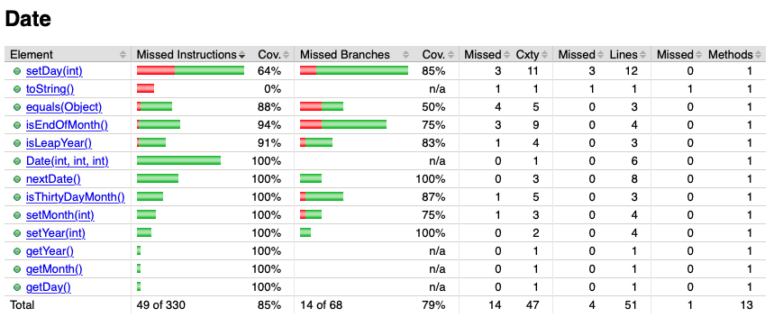
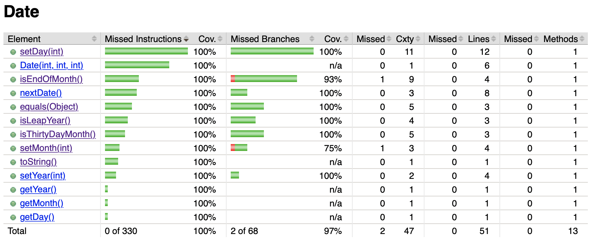

# SEG3103 Laboratory 3

| Information | Value |
| --- | --- |
| Course | SEG 3103 |
| Semester | Summer 2021 |
| Professor | Andrew Forward |
| TA | Nazanin Bayati |
| Student 1 | Félix Larouche (300144353) |
| Student 2 | Emma Dobson Takoff (300108505) |

This is the third laboratory for the course SEG3103.


## Exercise 1

**Derive a test suite for 100% X coverage for class Date: statement coverage, branch coverage, condition coverage, and condition/branch coverage.**

First, we ran Jacoco against the existing Date tests and observed the coverage.



Then we added additional tests in the DateTest.java file to achieve better coverage. The following image shows the results we obtained.



First, we achieved 100% coverage for the method isThirtyDayMonth(). The initial test suite did not include a test case for the month of September (month 9), which is a thirty day month. We added the following test case:
```java
@Test
void nextDate_month9() {
    Date today = new Date(1901, 9, 1);
    Date expectedTomorrow = new Date(1901, 9, 2);
    assertEquals(expectedTomorrow, today.nextDate());
}
```

Next, we achieved 100% coverage for the method isLeapYear(). The initial test suite did not include a test where the year was a century year divisible by 400. So, we added the following test case, where the year is 2000 (which is a century year divisible by 400):
```java
@Test 
void nextDate_leapYear(){
    Date today = new Date(2000, 1, 1);
    Date expectedTomorrow = new Date(2000, 1, 2);
    assertEquals(expectedTomorrow, today.nextDate());
}
```

Then, we improved the coverage for the method isEndOfMonth(). The initial test suite did not include a test where the year is not a leap year, the month is February (2), and the day is the 28th. As well, it did not include a test where the year is a leap year, the month is February (2), and the day is the 28th. We added these tests, as shown here:
```java
@Test
void nextDate_endOfMonth(){
    Date today = new Date(2021, 2, 28);
    Date expectedTomorrow = new Date(2021, 3, 1);
    assertEquals(expectedTomorrow, today.nextDate());
}

@Test
void nextDate_endOfMonth2(){
    Date today = new Date(2020, 2, 28);
    Date expectedTomorrow = new Date(2020, 2, 29);
    assertEquals(expectedTomorrow, today.nextDate());
}
```
However, it is not possible to obtain 100% coverage. It is impossible for the month of February to have 29 days if it is not a leap year, so the branch with this condition cannot be covered.

Furthermore, we achieved 100% coverage for the equals(Object) method. The original test suite did not include tests where a date was compared to an object. The equals() method should return False in this case. We also had to add tests to compare dates where the year, month, and day are different between the two dates (nextDate_equals2()), where the months and days are different between the two dates (nextDate_equals3()), and where the days are different between the two days (nextDate_equals4()). These tests are shown here:
```java
@Test
void nextDate_equals(){
    Object obj = new Object();
    Date date = new Date(2021,5,27);
    assertFalse(date.equals(obj));
}

@Test
void nextDate_equals2(){
    Date date = new Date(2021,5,27);
    Date date2 = new Date(2020,4,26);
    assertFalse(date.equals(date2));
}

@Test
void nextDate_equals3(){
    Date date = new Date(2021,5,27);
    Date date2 = new Date(2021,4,26);
    assertFalse(date.equals(date2));
}

@Test
void nextDate_equals4(){
    Date date = new Date(2021,5,27);
    Date date2 = new Date(2021,5,26);
    assertFalse(date.equals(date2));
}
 ```

Next, we achieved full coverage for the toString() method by adding the following test:
```java
@Test
void nextDate_toString(){
    Date date = new Date(2021,5,27);
    assertEquals("2021/May/27",date.toString());
}
```

Lastly, we achieved full coverage for the setDay(int) method by adding the following tests which test for the cases where the day is greater than 31, where the day is greater than 30 for a 30-day month, and where the day is greater than 29 in February in a leap year:
```java
@Test
void nextDate_invalid_setDay() {
    assertThrows(
      IllegalArgumentException.class,
      () -> new Date(1975, 6, 32)
    );
}

@Test
void nextDate_invalid_setDay2() {
    assertThrows(
      IllegalArgumentException.class,
      () -> new Date(2010, 4, 31)
    );
}

@Test
void nextDate_invalid_setDay3() {
    assertThrows(
      IllegalArgumentException.class,
      () -> new Date(2020, 2, 30)
    );
}
```

Another reason we cannot achieve 100% coverage for Date.java is that in the setMonth() method, the month cannot be less than 1 and greater than 12 at the same time. Therefore, only 3 out of 4 branches can be covered by the test cases.

## Exercise 2


**Refactor Date.java. Run coverage after refactoring.**
