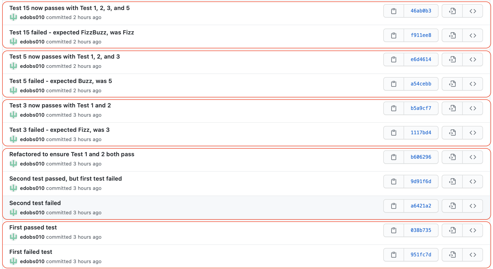

# SEG3103 Laboratory 4

| Information | Value |
| --- | --- |
| Course | SEG 3103 |
| Semester | Summer 2021 |
| Professor | Andrew Forward |
| TA | Nazanin Bayati |
| Student 1 | Félix Larouche (300144353) |
| Student 2 | Emma Dobson Takoff (300108505) |

This is the fourth laboratory for the course SEG3103.

## Test Driven Development

We decided to develop the FizzBuzz project for this exercise. 

We created the class FizzBuzzTest.java to implement the fizzBuzz method.

To compile it, we run ```javac -encoding UTF-8 --source-path test -d dist -cp dist:lib/junit-platform-console-standalone-1.7.1.jar test/*.java```. To run the tests, we run ```java -jar lib/junit-platform-console-standalone-1.7.1.jar --class-path dist --scan-class-path```.


First we implemented the fizzBuzz(int num) method with a series of 5 commit groups. This implementation returns a single string based on the number passed to the method. For example, if 4 is passed, the string "4" will be returned. If 15 is passed, "FizzBuzz" is returned. Each commit group starts with a failed test, followed by a passed test. The commits can be seen in the screenshot below. Note that, due to the simplicity of the method, we didn't always have a need to refactor after the failed/passed tests.



Next, we implemented the fizzBuzzArray(int num) method with a series of 5 commit groups. This second implementation returns an array of strings from 1 to num (with the numbers replaced by "Fizz", "Buzz", and "FizzBuzz" accordingly). Like before, each commit group starts with a failed test, followed by a passed test. The commits can be seen in the screenshot below. Note again that, due to the simplicity of the method, we didn't always have a need to refactor after the failed/passed tests.


Note: We were in contact with Nazanin who told us implementing two methods in order to have 10 commit groups.