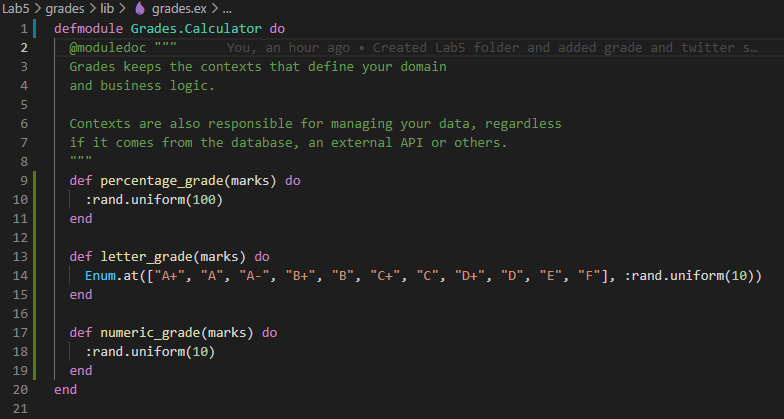
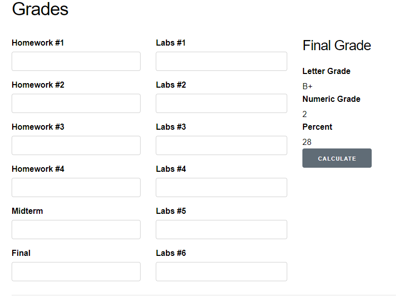
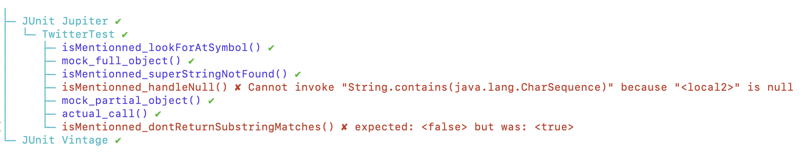
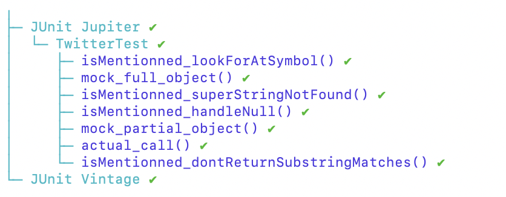

# SEG3103 Laboratory 5

| Information | Value |
| --- | --- |
| Course | SEG 3103 |
| Semester | Summer 2021 |
| Professor | Andrew Forward |
| TA | Henry Chen |
| Student 1 | Félix Larouche (300144353) |
| Student 2 | Emma Dobson Takoff (300108505) |

This is the fifth laboratory for the course SEG3103.

## Stubs

After compiling and running the application successfully, we stubbed the three methods in Grades.Calculator (namely, percentage_grade, letter_grade, and numeric_grade). The following screenshot shows are stubbed code.



The following screenshot shows an example of the application working with the stubbed code.



After replacing our stubbed module to make the application work for real, we observed the following error.


## Mocks

We have implemented the 4 missing test cases in the TwitterTest.java file. The following screenshot shows the results of running the tests.



By looking at the code of isMentionned, we can see why two of the tests failed. We modified the code of isMentionned as follows to handle the cases where the tweet is null, or where finding a matching substring in the tweet should not return true.

```java
public boolean isMentionned(String name) {
    String tweet = loadTweet();
    if (tweet==null){
      return false;
    }
    int index = tweet.indexOf("@");
    int index2 = tweet.indexOf(" ",index);
    if (index2==-1){
      tweet = tweet.substring(index);
    }else{
      tweet = tweet.substring(index,index2);
    }
    return tweet.equals("@" + name); 
  }
```

The following screenshot shows the results of the tests after making the changes to the isMentionned method. All tests pass successfully now.

