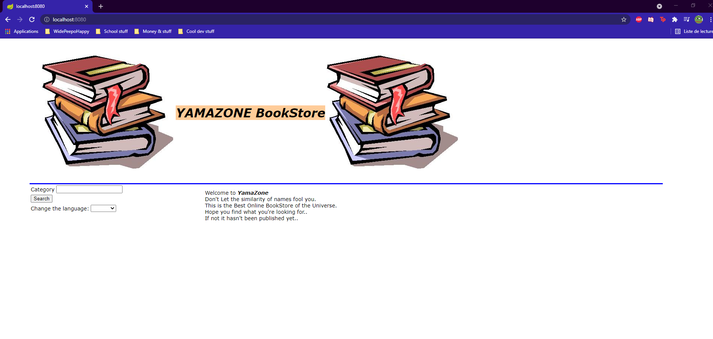
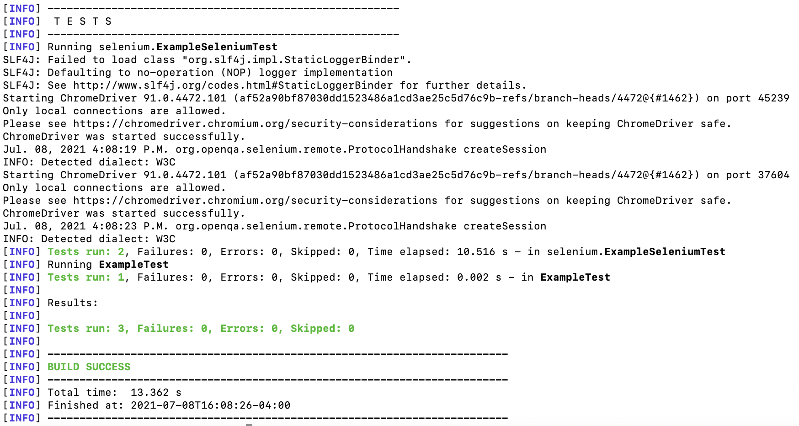
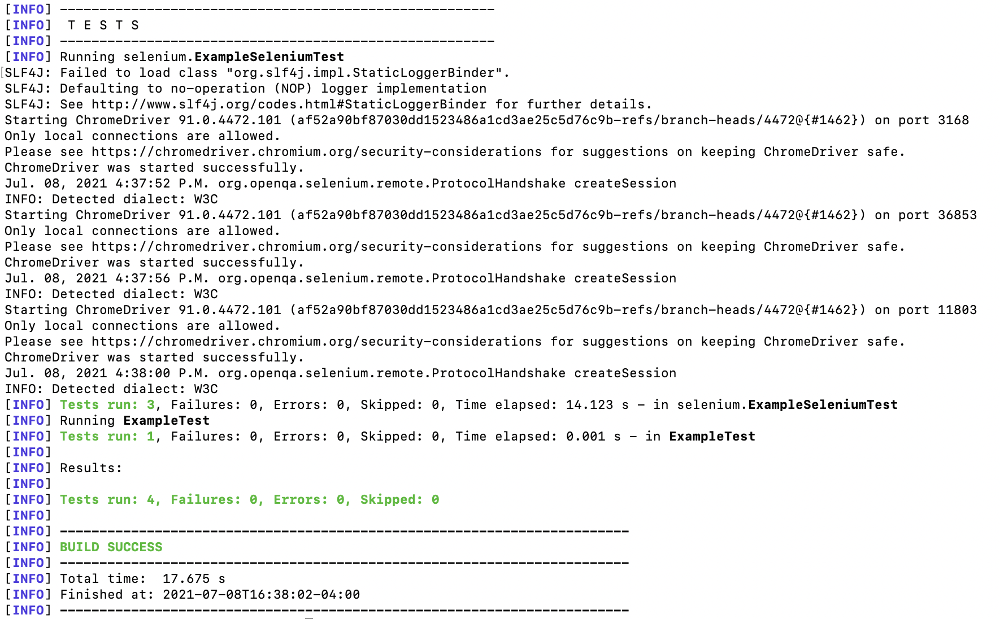

# SEG3103 Laboratory 6

| Information | Value |
| --- | --- |
| Course | SEG 3103 |
| Semester | Summer 2021 |
| Professor | Andrew Forward |
| TA | Henry Chen |
| Student 1 | Félix Larouche (300144353) |
| Student 2 | Emma Dobson Takoff (300108505) |

This is the sixth laboratory for the course SEG3103.

## Automated User Acceptance Testing with Selenium WebDriver

After extracting BookstoreApp.zip, we ran `mvn compile` and then `java -jar ./target/BookstoreApp-0.1.0.jar`. 

Here is a screenshot of the application running:


To run the tests, we ran mvn test.

Here is a screenshot of the three tests passing:


Next, we added an additional Selenium web driver test to test the login process.

Here is the code for this:
```java
  @Test
  public void test3() {
    driver.get("http://localhost:8080/admin");

    WebElement username = driver.findElement(By.id("loginId"));
    username.sendKeys("admin");

    WebElement password = driver.findElement(By.id("loginPasswd"));
    password.sendKeys("password");

    WebElement signIn = driver.findElement(By.id("loginBtn"));
    signIn.click();

    String actualUrl="http://localhost:8080/admin";
    String expectedUrl= driver.getCurrentUrl();
    assertEquals(expectedUrl, actualUrl);

  }
```

Here is a screenshot of the four tests passing:
