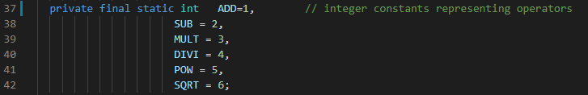

# SEG3103 Laboratory 7

| Information | Value |
| --- | --- |
| Course | SEG 3103 |
| Semester | Summer 2021 |
| Professor | Andrew Forward |
| TA | Henry Chen |
| Student 1 | Félix Larouche (300144353) |
| Student 2 | Emma Dobson Takoff (300108505) |

This is the seventh laboratory for the course SEG3103.

## Automated Static Analysis with SpotBugs

First, we compiled the app with `javac -encoding UTF-8 --source-path src -d dist src/*.java` and ran it with `java -cp ./dist Main`.

Here is a screenshot of the app running:

Here is a screenshot of the initial SpotBugs analysis:

### Bug 1: Comparison of String parameter using == or !=

Here is a screenshot of the code before changes:

Here is a screenshot of the fixed bug:\

To do the comparison we replaced the == with the .equals() method.

### Bug 2: Certain swing methods needs to be invoked in Swing thread

Here is a screenshot of the bug:

Description of bug: In the main method, the isVisible() Swing method is being called which could cause deadlocks or other threading issues since Java Swing components are not thread-safe in Java.

### Bug 3: Could be refactored into a named static inner class

Here is a screenshot of the bug:

To fix the code we would, create a WindowAdapter class within the CalCFrame class and in the CalCFrame method we would call WindowAdapter.WindowClosing(WindowEvent e), passing in a WindowEvent as as argument, instead of having to create a new WindowAdapter.

### Bug 4: Private method is never called

Here is a screenshot of the method causing the bug, since it is never called:

To fix the bug, we would simply delete this private method, as shown in this screenshot where we simply commented out the code:

### Bug 5/6: Boxing/unboxing to parse a primitive

Here are screenshots of the bugs before making changes to the code:

Here is a screenshot of the fixed bugs where we used Java's parse method:

### Bug 7-12: Boxing/unboxing to parse a primitive (2)

Here is a screenshot of the bugs before making any changed to the code:

To fix the bugs, we simply had to make the field static, as seen in the screenshot below:

### Bug 13: Method uses the same code for two branches

Here is a screenshot of the bug before changing the code:

To fix the bug, we simply need to remove the else if to remove the redundancy:\

### Bug 14: Switch statement found where default case is missing

Here is a screenshot of the bug:

To fix this bug, we would add a default case which would execute if none of the cases were matched. The default case could handle an invalid operator and return an error message.

### Bug 15-18: Condition has no effect

Here is a screenshot of the bugs 15-17:

To fix this we replaced the if, else statements with one line since the same line of code was supposed to be executed regardless of the value of i, meaning that the if, else blocks were unnecessary. Here is a screenshot of the change we made:

Here is a screenshot of bug 18:

To fix the bug, we can replace the else if statement with an else statement as shown in the screenshot below:

### Summary
In total we fixed 15 bugs. Here is a screenshot of the analysis after fixing the bugs:

As expected, all bugs that we fixed no longer showed up in the analysis but since we did not fix 3 of them there are 3 remaining.
